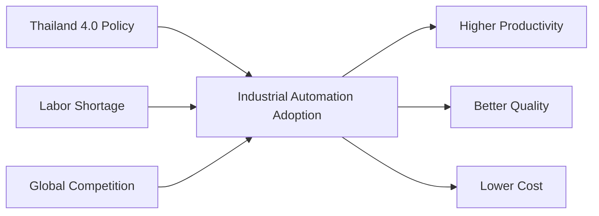

## 🌏 ND3 learning journey 2025

## 1. Thailand’s Industrial Automation

# Thailand’s Industrial Automation

#### 1.1 ภาพรวม (Overview)

    Industrial Automation ในประเทศไทย คือการนำเทคโนโลยีควบคุมอัตโนมัติ เช่น PLC, Robotics, SCADA, IoT และ AI  
มาใช้ในภาคอุตสาหกรรมเพื่อเพิ่ม **ประสิทธิภาพ (Efficiency)**, **คุณภาพ (Quality)** และ **ความสามารถในการแข่งขัน (Competitiveness)**

ประเทศไทยเป็นศูนย์กลางการผลิตที่สำคัญในอาเซียน โดยเฉพาะ:

- ยานยนต์
- อิเล็กทรอนิกส์
- อาหารและเครื่องดื่ม
- ปิโตรเคมี
- พลังงาน

---

#### 1.2 ปัจจัยขับเคลื่อน (Key Drivers)

## 2. Industrial Networking and IoT

#### 2.1 บทนำ (Introduction)

Industrial Networking และ Industrial IoT (IIoT) เป็นหัวใจสำคัญของระบบอุตสาหกรรมสมัยใหม่  
ช่วยให้เครื่องจักร อุปกรณ์ และระบบควบคุมสามารถ **สื่อสาร แลกเปลี่ยนข้อมูล และเชื่อมต่อกับระบบ IT / Cloud** ได้อย่างมีประสิทธิภาพ  
เป็นพื้นฐานของแนวคิด **Industry 4.0** และ **Smart Factory**

---

#### 2.2 Industrial Networking คืออะไร

Industrial Networking คือระบบเครือข่ายที่ใช้ในการเชื่อมต่ออุปกรณ์ในโรงงาน เช่น

- PLC
- HMI
- Sensors / Actuators
- Drives / Inverters
- SCADA Systems

#### คุณสมบัติสำคัญ

- ความเสถียรสูง (High Reliability)
- การสื่อสารแบบ Real-time หรือ Deterministic
- ทนทานต่อสภาพแวดล้อมอุตสาหกรรม
- รองรับการทำงานต่อเนื่อง 24/7

---

#### 2.3 โปรโตคอล Industrial Network ที่นิยม

#### 2.3.1 Fieldbus (รุ่นดั้งเดิม)

- Modbus RTU
- Profibus
- CANopen
- DeviceNet

#### 2.3.2 Industrial Ethernet

- Modbus TCP
- PROFINET
- EtherNet/IP
- EtherCAT
- POWERLINK

#### 2.3.3 Wireless Industrial Network

- Industrial Wi-Fi
- WirelessHART
- ISA100
- 5G (Industrial 5G)

---

#### 2.4 โครงสร้างเครือข่ายในโรงงาน (Industrial Network Architecture)

#### ระดับชั้น (Purdue Model)

1. Level 0 – Sensors & Actuators  
2. Level 1 – PLC / Controllers  
3. Level 2 – HMI / SCADA  
4. Level 3 – Manufacturing Execution System (MES)  
5. Level 4 – Enterprise IT / ERP  

---

#### 2.5 Industrial IoT (IIoT) คืออะไร

Industrial IoT คือการนำ **IoT Technology** มาใช้กับระบบอุตสาหกรรม  
โดยเชื่อมโยงข้อมูลจากเครื่องจักรไปยังระบบวิเคราะห์, Cloud และ AI

### เป้าหมายหลัก

- เพิ่มประสิทธิภาพการผลิต
- ลด Downtime
- Predictive Maintenance
- Data-driven Decision

---

#### 2.6 องค์ประกอบของ Industrial IoT

#### 2.6.1 Devices & Sensors

- Temperature, Pressure, Vibration
- Energy Meters
- Smart Sensors

#### 2.6.2 Edge Devices / Gateways

- Industrial PC
- IoT Gateway
- Protocol Converter (OT → IT)

#### 2.6.3 Communication Protocols (IoT)

- MQTT
- OPC UA
- HTTP/REST
- AMQP
- CoAP

#### 2.6.4 Cloud & Platform

- AWS IoT
- Azure IoT
- Google Cloud IoT
- On-Premise IoT Platform

---

#### 2.7 Industrial Networking vs Industrial IoT

| หัวข้อ       | Industrial Networking | Industrial IoT                |
| ------------ | --------------------- | ----------------------------- |
| วัตถุประสงค์ | ควบคุมเครื่องจักร     | วิเคราะห์และเพิ่มมูลค่าข้อมูล |
| Real-time    | สูงมาก                | ปานกลาง                       |
| โปรโตคอล     | Fieldbus / Ethernet   | MQTT / OPC UA                 |
| การเชื่อมต่อ | ภายในโรงงาน           | โรงงาน ↔ Cloud                |
| ความปลอดภัย  | Network Isolation     | Cybersecurity สำคัญมาก        |

---

#### 2.8 ความปลอดภัย (Industrial Cybersecurity)

- Network Segmentation (VLAN, Firewall)
- Authentication & Authorization
- Encryption (TLS)
- Secure Remote Access
- IEC 62443 Standard

---

#### 2.9 Use Cases ที่พบบ่อย

- Smart Factory Monitoring
- Predictive Maintenance
- Energy Management
- Remote Monitoring & Control
- Quality Traceability

---

#### 2.10 แนวโน้มในอนาคต

- Time-Sensitive Networking (TSN)
- 5G Industrial Network
- Edge AI
- Digital Twin
- Fully Connected Smart Factory

---

#### 2.11 สรุป

Industrial Networking เป็นรากฐานของการควบคุมระบบอุตสาหกรรม  
Industrial IoT ช่วยต่อยอดข้อมูลเพื่อการวิเคราะห์และเพิ่มประสิทธิภาพ  
เมื่อรวมกันจะทำให้โรงงานก้าวสู่ **Industry 4.0** อย่างสมบูรณ์

## 3. Digital Twins

## 4. Data Processing and Machine Learning

## 5. Future Works/Projects
